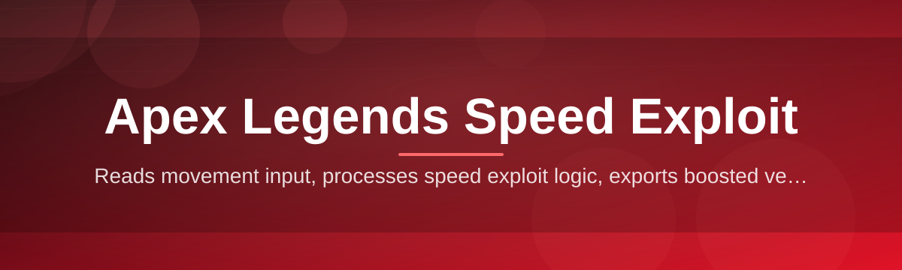
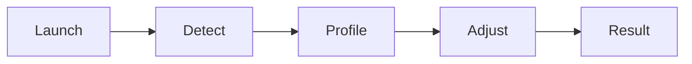

# apex-legends-speed-booster 🚀⚡

  

*Move faster, rotate smarter, and stop watching the storm from the wrong side of the map.*

  

## 🧭 Overview

Back in early 2025, a small crew of Apex tinkerers got tired of losing third-party fights simply because they got caught mid-rotation. What started as a scrappy weekend script to shave a few frames off movement timing has grown into **apex-legends-speed-booster** — a focused, standalone utility built entirely around one idea: your rotations should be as sharp as your aim.

This project sits in a very specific niche. It's not a full-blown game modification suite, it's not an aimbot, and it's not trying to rewrite the netcode. It's a lightweight companion tool that tunes movement responsiveness so that tap-strafes, wall bounces, and superglides feel consistent instead of feeling like a coin flip. The Apex Legends speed community has spent years documenting movement tech frame-by-frame, and this tool exists to make that knowledge *actionable* rather than just theoretical.

Who is this for? Ranked grinders who need every rotation edge in Diamond-plus lobbies, content creators who want buttery-smooth movement clips, and casual players who just want to stop eating third-party damage because their character felt sluggish out of a slide. If any of that sounds like you, keep reading — this README is going to walk you through everything, step by step, like a friend showing you the ropes.

## 📥 Get the Tool

> [!NOTE]
> The button above is the **only official download source**. Everything else floating around forums or Discord servers claiming to be this project is not maintained by us and should be treated with suspicion.

---

## 🔥 What Makes It Tick

- **Adaptive Movement Tuning** — instead of a blunt global multiplier, the tool reads your current momentum state (sliding, airborne, grounded) and nudges responsiveness accordingly, so tap-strafes land the way they do in the clips you've been studying.

- **Frame-Timing Assistant** — a lightweight overlay counts the exact input window for wall bounces and superglides, turning "muscle memory guesswork" into something you can actually see and correct in real time.

- **One-Click Profiles** — swap between "Ranked Rotation," "Warm-Up," and "Content Capture" presets without digging through menus. Each profile tunes sensitivity-adjacent movement values for a different goal.

- **Zero Background Footprint** — the tool runs, does its job, and gets out of the way. No always-on services, no telemetry pings home, no mystery processes eating your CPU during a Kings Canyon drop.

- **Legend-Aware Presets** — Octane, Wraith, and Horizon each interact with slide-hopping and tactical movement slightly differently, so presets are tuned per-legend rather than as a one-size-fits-all slider.

- **Session Logging** — every run generates a local, human-readable log so you can review exactly what timing adjustments were applied, useful for troubleshooting or just satisfying your curiosity.

- **Hotkey-Driven Workflow** — toggle everything without alt-tabbing out of the match. Designed by people who understand that a five-second menu detour can cost you a fight.

- **Auto-Update Checker** — pings the landing page (not your game files) to let you know when a newer, better-tuned version is available.

> [!TIP]
> New to movement tech in general? Spend your first session in "Warm-Up" profile in the firing range before taking anything into a ranked match. It maps input timing to visual feedback so you build the muscle memory faster.

---

## 🏁 How to Get Started

Getting up and running takes less time than a single ring rotation. Here's the flow:

1. **Visit the landing page** using the download button above — this is the single source of truth for builds.
2. **Grab the latest build** for your Windows version; the page will show you what's current.
3. **Run the executable** — no installer wizard, no background services, just a direct launch.
4. **Pick a profile, drop into a match**, and let the tool do its quiet work in the background while you focus on positioning.

> [!IMPORTANT]
> Always launch the tool *before* Apex Legends fully loads into a match lobby. Launching mid-match can cause the timing assistant to miss its calibration window.

---

## 💻 System Requirements

| Component | Minimum | Recommended |
|---|---|---|
| OS | Windows 10 (64-bit) | Windows 11 (64-bit) |
| RAM | 4 GB free | 8 GB free |
| Storage | 150 MB | 300 MB |
| Dependencies | None | None |
| .NET / Runtimes | Bundled internally | Bundled internally |

No external frameworks, no dependency chains to chase down — it's genuinely standalone. Download it, run it, done.

---

## 🛠️ How It Works

The internal workflow is intentionally simple, because simple things are reliable things:

1. The tool boots and reads the current game window state without touching protected memory regions.
2. It listens for movement input patterns (slide, jump, direction change) at the OS input layer.
3. When a recognized pattern matches your selected profile, it applies a micro-timing adjustment.
4. The result gets logged locally and reflected instantly in your in-match movement feel.
5. On session end, a summary is written so you can review what happened.

🔬 Curious about the timing assistant specifically?

The overlay doesn't modify game files — it observes input timing and renders a translucent frame-counter near your crosshair. Think of it as a metronome for your wall bounces rather than anything that touches Respawn's server-side logic.

---

## 🩹 Troubleshooting

**Q: The tool launches but movement feels unchanged.**
> Double-check that you selected a profile before dropping into the match — the default state is intentionally neutral until you pick one.

**Q: My frame-timing overlay isn't showing up.**
> This usually happens on high-refresh monitors with scaling enabled. Try setting Windows display scaling to 100% and relaunch.

**Q: Does this get detected by anti-cheat?**
> The tool operates entirely at the input layer and does not read or write to the game's process memory. That said, always use good judgment and keep the tool updated, since the landing page reflects the most current, tested build.

**Q: Can I use this alongside my mouse software (Logitech G HUB, Razer Synapse)?**
> Yes — just make sure your mouse macros aren't also remapping the same keys used for the tool's hotkeys, or you'll get conflicting inputs.

**Q: The app won't launch at all.**
> Right-click and "Run as Administrator" once. Windows occasionally sandboxes newly downloaded executables until you do this the first time.

**Q: Where do I report a bug?**
> Open an issue in this repository with your Windows version, legend used, and a short description of what you expected versus what happened.

---

## 🎨 UI / UX Details

The interface was designed to be glanceable — you should never need to stare at it mid-fight.

- **Themes:** Dark (default), Legend-Accent (color shifts based on selected legend), and a High-Contrast mode for accessibility.
- **Keyboard Shortcuts:**
  - `F1` — toggle overlay visibility
  - `F2` — cycle movement profile
  - `F3` — open session log
  - `Ctrl+Shift+Q` — full quit
- **Settings persistence:** your last-used profile and theme are remembered between sessions automatically.
- **Overlay opacity slider** for players who want the timing assistant present but subtle.

> [!TIP]
> If you stream, use the High-Contrast theme with overlay opacity around 40% — it stays informative on camera without becoming a distraction for viewers.

---

## 🤝 Contributing & Community

This project grew because movement-tech enthusiasts kept sharing timing data and edge cases. That spirit continues:

- Fork the repo, branch off `main`, and open a pull request with a clear description of what changed and why.
- Bug reports are genuinely welcome — include your OS build and a repro scenario if possible.
- Feature requests around new legend-specific presets are especially appreciated since the community has deep knowledge here.
- Be respectful in discussions. Movement tech debates get heated; keep it constructive.

> [!WARNING]
> Please don't open issues asking for anti-cheat detection status guarantees — nobody outside Respawn can make that promise, and speculative claims help no one.

---

## 📜 License

Released under the [MIT License](LICENSE), 2026. Use it, fork it, learn from it — just keep the license notice intact.

---

## ⚠️ Disclaimer

This tool is provided for educational and personal-use purposes related to studying Apex Legends movement mechanics. It is not affiliated with, endorsed by, or associated with Respawn Entertainment or Electronic Arts in any way. Use of any third-party tool alongside an online multiplayer game carries inherent risk, and you are solely responsible for how you use this software and any consequences that follow. The maintainers make no guarantees regarding compatibility with future game updates or anti-cheat systems.

---

